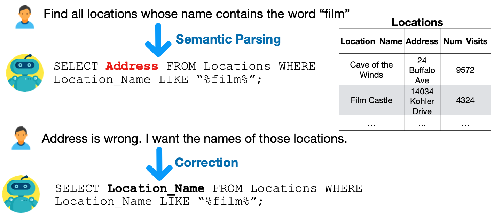

# SPLASH: Semantic Parsing with Language Assistance from Humans
SPLASH is dataset for the task of semantic parse correction with natural language feedback in the context of text-to-SQL parsing.



The task, dataset along with baseline results are presented in
<br/>[Speak to your Parser: Interactive Text-to-SQL with Natural Language Feedback.](https://www.aclweb.org/anthology/2020.acl-main.187/)<br/>Ahmed Elgohary, Saghar Hosseini and Ahmed Hassan Awadallah.<br/>ACL 2020.

## Release
The `train.json`, `dev.json` and `test.json` contain the training, development and testing examples of SPLASH. In addition to that, we also release the 179 examples that are based on the EditSQL parser (Please, see section 6.3 in the paper for more details). The EditSQL examples are in `editsql.json`. SPLASH is distributed under the [CC BY-SA 4.0](https://creativecommons.org/licenses/by-sa/4.0/legalcode) license.

## Format
Each example contains the following fields:

`db_id`: Name of Spider database.  

`question`: Question (Utterance) as provided in Spider.

`predicted_parse`: The predicted SQL parse by the relevant model.

`predicted_parse_with_values`: The predicted SQL with the values (annonomized in `predicted_parse`) inferred by a rule-based post-processor. Note that we still use Spider's evaluation measure which ignores the values, but inferring values for the predicted parse is essential for generating meaningful explanations. 

`predicted_parse_explanation`: The generated natural language explanation of the predicted SQL.

`feedback`: Collected natural language feedback.

`gold_parse`: The gold parse of the given question as provided in Spider.

`beam`:  The top 20 predictions with corresponding scores produced by Seq2Struct beam search.

Please, refer to the paper for more details.

## Example
```
    {
        "db_id": "csu_1", 
        "question": "Which university is in Los Angeles county and opened after 1950?", 
        "predicted_parse": "SELECT T1.Campus FROM Campuses AS T1 JOIN faculty AS T2 ON T1.Id = T2.Campus WHERE T1.County = value AND T1.Year > value AND T2.Year > value", 
        "predicted_parse_with_values": "SELECT T1.Campus FROM Campuses AS T1 JOIN faculty AS T2 ON T1.Id = T2.Campus WHERE T1.County = \"Los Angeles\" AND T1.Year > 1950 AND T2.Year > 2002",
        "predicted_parse_explanation": [
            "Step 1: For each row in Campuses table, find the corresponding rows in faculty     
            table", 
            "Step 2: find Campuses's Campus of the results of step 1 whose County equals Los 
             Angeles and Campuses's Year greater than 1950 and faculty's Year greater than 2002"
        ],
        "feedback": "In step 2 Remove faculty 's year greater than 2002\".", 
        "gold_parse": "SELECT campus FROM campuses WHERE county  =  \"Los Angeles\" AND YEAR  >  
        1950", 
        "beam": [
            [
                "SELECT T1.Campus FROM Campuses AS T1 JOIN faculty AS T2 ON T1.Id = T2.Campus WHERE T1.County = value AND T2.Year > value AND T2.Year > value", 
                -1.5820374488830566
            ], 
            [
                "SELECT T1.County FROM Campuses AS T1 JOIN faculty AS T2 ON T1.Id = T2.Campus WHERE T1.Campus = value AND T2.Year > value AND T2.Year > value", 
                -2.0078020095825195
            ], 
            ..
  }          
```

#
#### Please, contact Ahmed Elgohary < elgohary@cs.umd.edu > for any questions/feedback.

## Citation
 
```
@inproceedings{Elgohary20Speak,
Title = {Speak to your Parser: Interactive Text-to-SQL with Natural Language Feedback},
Author = {Ahmed Elgohary and Saghar Hosseini and Ahmed Hassan Awadallah},
Year = {2020},
Booktitle = {Association for Computational Linguistics},
}
```
